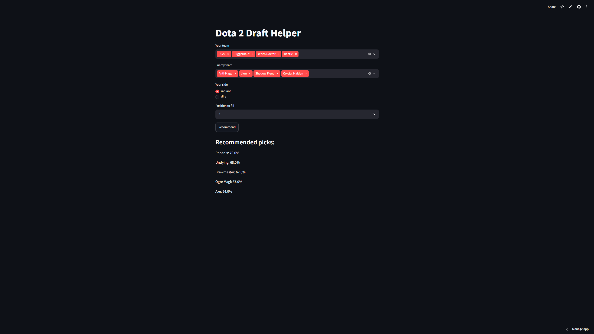

# Dota 2 Draft Helper

Dota 2 is a strategy MOBA game, two teams of five take turns picking heroes before the match starts. Picking is a key strategic part of the game — the right pick depends on what's already been chosen, because some heroes counter others and some work better together. This tool uses machine learning to suggest which hero to pick based on the current draft.

You enter your team and the enemy team, pick a position, and it recommends the heroes that fit best against that composition. It returns the top 5 options ranked by predicted win rate, so if your first choice gets banned, you still have alternatives.

Trained on 10,000 high-rank ranked Dota 2 matches. This is a v1. It works, but there's a roadmap (see below).

**Live demo:** https://dota-draft-apper-sjyzo4ecjdh6y4uncftbqo.streamlit.app

---

## What it does

- You pick your team, the enemy team, your side (radiant/dire), and the position you need to fill.
- The model evaluates every available hero and ranks them by predicted win rate for your draft.
- You get the top 5 picks, with a win probability for each.
- The model reacts to the enemy composition — different enemy lineups give different recommendations, not just a fixed "best heroes" list.




---

## How to run locally

### Linux

```bash
git clone https://github.com/kowka322/dota-draft-helper.git
cd dota-draft-helper


python -m venv .venv
source .venv/bin/activate        

pip install -r requirements.txt
streamlit run app.py
```


### Windows 

```bash
git clone https://github.com/kowka322/dota-draft-helper.git
cd dota-draft-helper


python -m venv .venv
source .venv/Scripts/activate        

pip install -r requirements.txt
streamlit run app.py
```

The trained model (`model.joblib`) and the hero index (`hero_to_index.joblib`) are included, so the app runs out of the box. If you want to collect fresh data and retrain, run `fetcher.py`, then `dataset.py`.

---


## Tech stack

- **Python** — core language
- **scikit-learn** — RandomForest model + LogisticRegression baseline
- **Streamlit** — web interface
- **OpenDota API** — match data source
- **joblib** — model serialization
- **pytest** — tests for the data filter    

---

## How it works

The project is a full pipeline from raw data to a deployed app.

**1. Data collection (`fetcher.py`)**
The OpenDota API proved to be the least reliable part of the pipeline. Long collection runs would regularly encounter HTTP 429 rate limits, occasional timeouts, and interrupted requests. Restarting a collection from scratch after several hundred matches would waste both time and API quota.

To make the scraper fault-tolerant, I implemented a custom JsonSaver context manager that checkpoints progress every 50 successfully collected matches. If the process crashes, gets rate-limited, or is manually stopped, collection can resume from the latest checkpoint instead of restarting from zero.

Rate limiting (HTTP 429) is handled separately through a `@retry_on_429` decorator from `decorators.py`, with automatic retries (3 times) and backoff.

**2. Feature engineering (`dataset.py`)**
Each match is turned into a one-hot vector of length 254 (127 heroes × 2 sides). The first half represents radiant picks, the second half dire. Hero IDs in Dota have gaps, so a mapping collapses them into a dense 0–126 index. Sides matter — who is against whom changes the outcome, so the vector keeps them separate.

**3. Model (`dataset.py`)**
A RandomForestClassifier trained on the vectors, with a LogisticRegression baseline for comparison. The model predicts whether radiant wins. For recommendations it uses `predict_proba` to rank candidates by win probability.

**4. Recommender (`app.py`)**
For the position you need to fill, the recommender takes every available hero, builds the full draft vector with that hero added, runs it through the model, and ranks the candidates by predicted win rate. Taken heroes are excluded, and an optional position filter narrows candidates to heroes that actually play that role.

**5. Interface (`app.py`)**
A Streamlit app where you select teams and position from dropdowns and get ranked recommendations.

---

## Engineering decisions

These are the problems I ran into and how I solved them. They were the most interesting part of the project.

**Augmentation: training on partial drafts**
In ranked all-pick, heroes are revealed in waves of two, so a real draft is visible at 2v2, 4v4, and 5v5 stages — never 3v3. A recommender that only knew complete 5v5 drafts would be useless during an actual draft in real time. So from each match I generate three partial drafts (2, 4, and 5 heroes per side) with the same win label. This turns 10,000 matches into ~30,000 training rows and teaches one model to handle drafts at any stage (except 0v0 of course).

**Catching a data leak**
My first version split the 30,000 vectors randomly into train and test, and got 83% accuracy. That's unrealistically high for draft prediction, so I knew something was wrong. The problem: augmented versions of the same match were landing in both train and test, so the model was effectively seeing test matches during training, which means it found a way to cheat. I fixed it by splitting on matches *first*, then generating vectors for each split separately. Accuracy dropped to an honest ~52%, which is the real number.

**RandomForest vs LogisticRegression**
Both models land around 52% accuracy — RandomForest doesn't beat the linear baseline. That's actually a finding. It means the signal in a draft is mostly additive (the sum of individual hero strengths), and pairwise interactions like synergies and counters carry little signal on plain one-hot features. Scaling the data from 5,000 to 10,000 matches didn't move the accuracy either, which confirms the ceiling is in the features, not the sample size. I kept RandomForest because it's the better base for the synergy features planned in phase 2.

**Manual role mapping**
The OpenDota public data doesn't include hero roles or pick order. To filter recommendations by position, I manually classified all ~127 heroes by the roles they play, using my own experience as a player. Heroes can appear in multiple positions.

**Why ~52% is a good result**
Draft isn't supposed to fully decide a Dota match. Player skill, execution, and in-game decisions matter much more. A model that predicted draft outcomes at 70%+ would be a red flag for a data leak, not a success. ~52% means there's a real, measurable signal in the draft, which is exactly what the recommender needs to rank picks. In the future I plan to improve accuracy by migrating to another API and providing more features and data.

---

## Limitations and future work

This is a v1. It works end to end, but there's a clear roadmap:

- **Migrate to the Stratz API** — it provides roles, synergies, counters, and laning data that OpenDota lacks, plus batch fetching for faster collection. This would replace the manual role mapping and add real interaction features.
- **Synergy and counter features** — the current model treats heroes mostly independently. Explicit pair features could push it past the additive ceiling.
- **More data** — 100k+ matches, which only becomes useful together with richer features for rare hero-pair interactions.
- **Rank-specific models** — separate models per skill bracket, since hero strength and the meta shift between ranks.
- **Marginalization for early stages** — at 4v4, average over the unknown enemy pick instead of ignoring it.
- **Historical hero win rates as features** — give the model explicit prior knowledge.
- **Per-stage models** — separate models for 2v2 / 4v4 / 5v5 instead of one shared model.

---

## Testing

`test_fetcher.py` covers the match validation filter with parametrized pytest tests — valid matches, individual bad fields, and bad team compositions.

```bash
pytest
```
